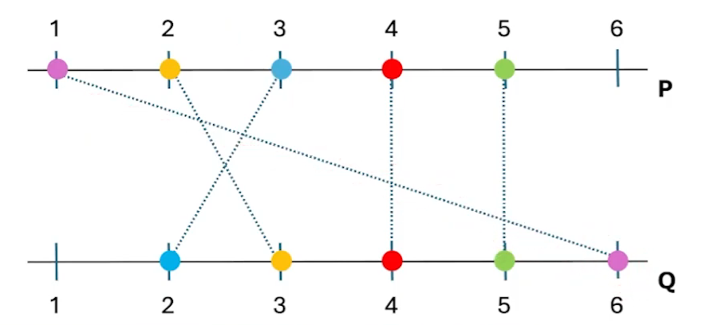

<h1 align="center" style="font-weight: bold;">Análise de Cruzamentos 🔀</h1>


<p align="center">
  <b>Este projeto é a implementação de um desafio clássico de programação utilizado em entrevistas para programadores do Facebook. O objetivo é criar um algoritmo eficiente, em Python, para contar quantas interseções ocorrem entre segmentos de linha conectando dois conjuntos de pontos paralelos.</b>
</p>

<h2 id="started">🚀 Inspiração e Referência</h2>

Segui os passos apresentados pelo canal AulasDev no YouTube, através deste vídeo: Desafio de Programação. O conteúdo foi essencial para entender a abordagem do problema e a construção da solução.

<h3>Descrição do Problema</h3>

Dadas duas linhas horizontais paralelas P e Q, cada uma contendo n pontos, precisamos contar quantos pares de segmentos conectando cada ponto pi a qi se intersectam.



Exemplo:

```bash
linha_p = [1,2,3,4,5]
linha_q = [6,3,2,4,5]
```
Cada ponto pi em linha_p está ligado ao correspondente qi em linha_q. O objetivo é contar quantos desses segmentos se cruzam.

<h3>Conceitos Aprendidos e Explorados</h3>

Durante o desenvolvimento deste projeto, aprofundei meus conhecimentos nos seguintes conceitos

| Sendo eles:|
|---------------|
|Lógica de programação: Estrutura de loops aninhados e condições para verificar cruzamentos.|
|Uso de ponteiros: Implementação eficiente usando índices para percorrer as listas.|
|Recursividade: Embora a solução atual não seja recursiva, analisei a possibilidade de aplicá-la.|
|Geometria computacional: Interseção entre segmentos de linha como aplicação prática.|
|Manipulação de intervalos: Comparação de posições relativas para identificar cruzamentos.|

<h3> Como Executar </h2>
Para rodar o programa, basta ter Python instalado e executar o script.

```bash
python contagem_intersecoes.py
```

<h2 id="contribute">📫 Contribuições</h2>

[📝 How to create a Pull Request](https://www.atlassian.com/br/git/tutorials/making-a-pull-request)

[💾 Commit pattern](https://gist.github.com/joshbuchea/6f47e86d2510bce28f8e7f42ae84c716)
